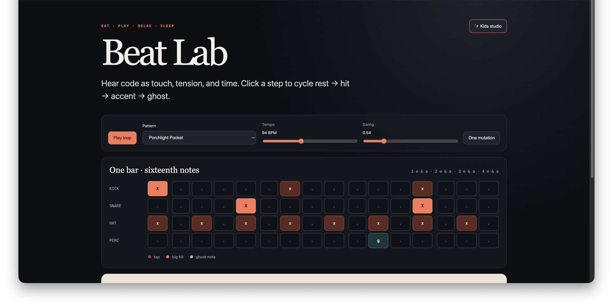
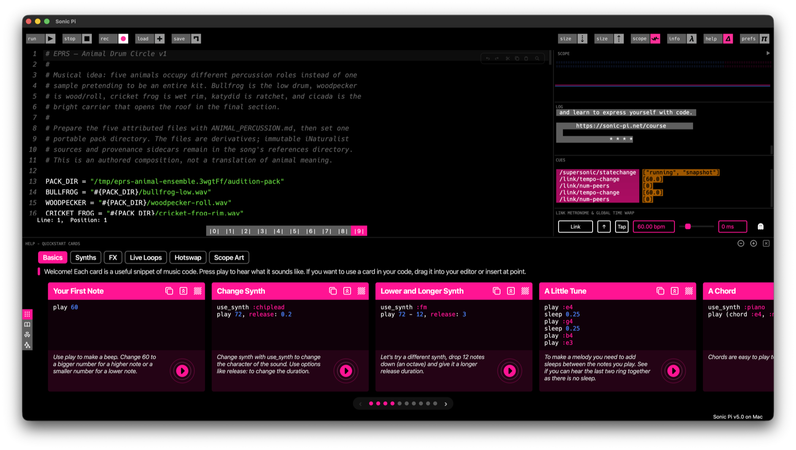
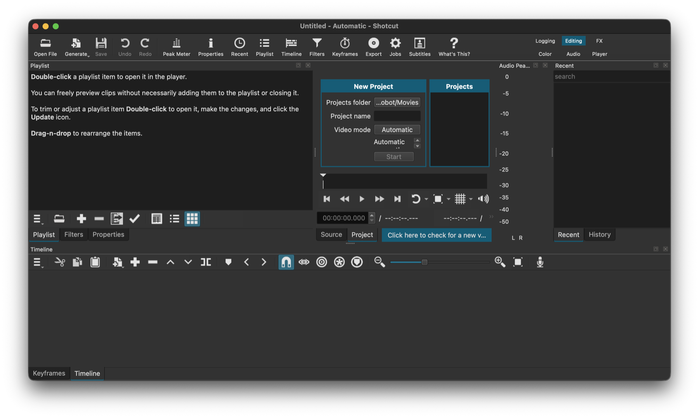

# EPRS tool map

EPRS keeps the creative record portable while allowing different tools to do
the work they are good at. A tool is an adapter or performance surface, not
the project database and not an approval authority.

## Screenshots

These captures are local macOS app views from the public EPRS workflow. They
are orientation aids; interfaces and versions will change.

<table>
  <tr>
    <td align="center"><strong>Beat Lab</strong> </td>
    <td align="center"><strong>Sonic Pi</strong> </td>
    <td align="center"><strong>Shotcut</strong> </td>
  </tr>
</table>

## Choose by musical job

| Surface | EPRS uses it for | The handoff that survives |
| --- | --- | --- |
| [Beat Lab](../studio/index.html) / [BeatScript](BEATSCRIPT.md) | Browser audition, deterministic rhythm, mutation, and portable text scores. | `.beat` source, seed, render, map, and listening decision. |
| [Sonic Pi](SONIC_PI.md) | Live-coded synthesis, samples, cues, MIDI/OSC, and performance. | Readable `.rb` source plus a bounded lossless capture and review. |
| [Audacity](RECORDING.md) | Human-operated recording, waveform editing, and audition. | Immutable raw take, native project when needed, and lossless export. |
| [Shotcut](SHOTCUT.md) | Optional local timeline editing, captions, and picture review. | Editable MLT project, source references, render facts, and picture review. |
| [Remotion](VISUALS.md) | Seeded, promptable, audio-reactive SVG worlds and delivery candidates. | Visual score, render sidecar, renderer-neutral picture candidate, and review. |
| [FFmpeg / FFprobe](VIDEO.md) | Lossless interchange, analysis, assembly, and delivery checks. | Exact media bytes, stream facts, checksums, and provenance. |
| [iNaturalist](ANIMAL_SOUND_AI_2026.md) | Attributed organism sound/photo references and authored studies. | Observation/media IDs, license, attribution, checksum, and reference boundary. |

## The boundary

The tool may produce a useful candidate, but EPRS still owns the surrounding
questions:

1. What was the player-facing intent?
2. Which source files and permissions were involved?
3. What changed, with which settings and seed?
4. What technical checks passed?
5. What did a person or agent hear/watch, and is it keep, change, or stop?

See [the toolchain registry](TOOLCHAIN.md) for capabilities and
[adapter profiles](ADAPTERS.md) for explicit handoff guidance. Machine paths,
credentials, and GUI-control preferences belong in ignored local configuration,
not in these public docs.
